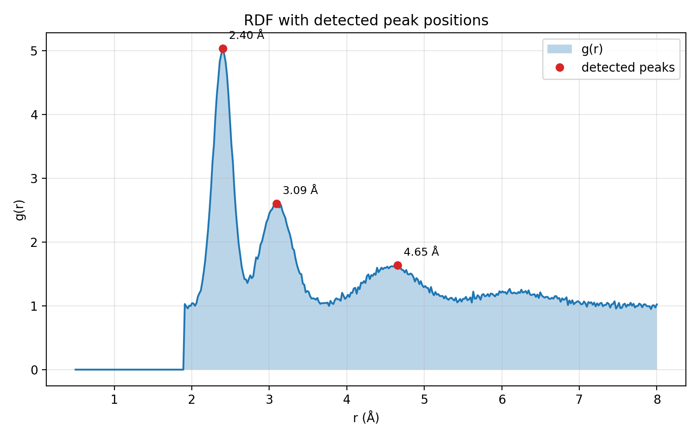

# Data Science Coursework: Six Worked Examples in Python

Six self-contained Python scripts covering the core of a practical data science workflow: array computation, data quality checking, data cleaning, working with public APIs, scientific visualization, and machine learning validation. Each script runs on its own, prints readable output, and documents the reasoning behind its choices.

The scripts began as graded assignments in a graduate data science course. They have been rewritten as standalone educational examples: the assignment prompts are removed, the bugs found during review are fixed, and every script runs without course files.

Author: Sahar Bayat

## Contents

| Script | Topic | Main tools |
|---|---|---|
| `01_casino_jackpot_grid.py` | Simulating and analyzing a 3D array of machine payouts; saving and loading data | NumPy, JSON |
| `02_data_quality_checks.py` | Reusable checks for missing values, bad dates, outliers, and inconsistent units | pandas |
| `03_data_cleaning.py` | A step-by-step cleaning pipeline with an audit trail and aggregate reporting | pandas |
| `04_census_license_density.py` | Geocoding addresses, joining to census population, and ranking tracts by license density | requests, pandas, Census APIs |
| `05_rdf_visualization.py` | Five plot types for a radial distribution function from molecular dynamics | Matplotlib, SciPy |
| `06_ml_validation.py` | Holdout versus cross-validation, and comparing three classifiers | scikit-learn |

## Quick start

```bash
git clone https://github.com/sba340/data-science-coursework.git
cd data-science-coursework
python -m venv .venv
source .venv/bin/activate        # Windows: .venv\Scripts\activate
pip install -r requirements.txt

python 01_casino_jackpot_grid.py
python data/generate_nurse_log.py   # only needed if data/nurse_log_sample.csv is missing
python 02_data_quality_checks.py
python 03_data_cleaning.py
python 04_census_license_density.py --demo
python 05_rdf_visualization.py
python 06_ml_validation.py
```

Python 3.9 or newer is recommended.

## About the data

No private or course-provided data is included.

* **Scripts 02 and 03** use `data/nurse_log_sample.csv`, a synthetic infirmary log with invented names. `data/generate_nurse_log.py` recreates it and deliberately injects missing values, impossible dates, mixed time units, typos, outliers, and inconsistent record numbers.
* **Script 04** needs a CSV of active licenses with a street address column. Use `--licenses`, `--street-column`, and `--skiprows` to describe your file. The `--demo` flag runs the ranking logic offline on synthetic data. Live runs call free Census Bureau APIs (no key required), pause one second between geocoding requests, and cache results in `data/census_tract_cache.json`.
* **Script 05** accepts any two-column text file (distance in angstroms, g(r)). Without an argument it generates a synthetic curve. The original simulation data are research data and are not distributed here.
* **Script 06** uses the breast cancer data set bundled with scikit-learn.

## What each script demonstrates

### 01. Casino jackpot grid

Simulates 12 hours of jackpot counts for a 6 by 6 machine grid as a `(12, 6, 6)` array, then computes per-machine averages, averages that ignore out-of-order hours (zeros), and a second simulation with high-performing machines disabled.

Improvements over the original: the original disabled whole rows of machines instead of individual machines, wrote text output with no separator between numbers (so `1` and `0` could not be told apart from `10`), and relied on pickle. The script now uses boolean masks, JSON and `.npy` formats with verified round trips, vectorized averages, and built-in self-checks.

### 02. Data quality checks

Four small functions (`count_missing`, `count_bad_dates`, `count_outliers`, `find_inconsistent_units`) and a per-column report. Hand-built test records with known answers verify each function, including leap-day edge cases.

Improvements: the original date format string had a typo (`%m/%d%y`) and the original test data appended random records to the source file on every run. Dates now rely on `strptime` for calendar validity, and the data file is never modified.

### 03. Data cleaning

Seven ordered steps, each a pure function: drop missing durations, drop impossible heights, repair supply counts, normalize time units, repair dates, make record numbers consistent, and report aggregates. The pipeline returns an audit trail of how many rows each step affected.

Improvements: in the original, hours were relabeled as minutes before the multiplication by 60 ran, so no conversion happened. Units are now parsed with a regular expression and converted correctly. The documented limitations of the monthly totals are listed in the script.

### 04. Census license density

Joins geocoded license addresses to tract-level population and ranks tracts by licenses per 1,000 residents and by total licenses.

Improvements: the original ranked license-level rows, so one tract appeared many times in the top 20. Licenses are now counted per tract before ranking. The script also treats the Census "not available" sentinel values in population as missing, uses timeouts and error handling, caches geocoding results, and accepts command-line options.

### 05. RDF visualization

Line, scatter, histogram (Freedman-Diaconis bin rule), annotated peak plot, and a two-panel figure. Figures are saved to `figures/`.

Improvements: the y axis is labeled correctly (g(r) is dimensionless, not a length), and the violin plot of binned values was replaced by an annotated peak plot, which answers the question a researcher actually asks of an RDF: where are the preferred distances.



### 06. Machine learning validation

Compares a 50/50 holdout with 5-, 10-, and 20-fold stratified cross-validation for Gaussian Naive Bayes, then compares Gaussian Naive Bayes, an SVM with and without feature scaling, and a random forest under identical folds.

Results with the fixed seed in the script:

| Evaluation | Mean accuracy | Std |
|---|---|---|
| GaussianNB, 50/50 holdout | 0.937 | n/a |
| GaussianNB, 5-fold CV | 0.940 | 0.025 |
| GaussianNB, 10-fold CV | 0.940 | 0.031 |
| GaussianNB, 20-fold CV | 0.940 | 0.034 |
| SVC, raw features | 0.914 | 0.032 |
| SVC, standardized | 0.977 | 0.018 |
| Random forest | 0.960 | 0.036 |

The validation schemes agree within noise, so the choice between them matters more for reliability than for the headline number. The largest effect in the table comes from preprocessing: standardizing features turns the weakest model into the strongest.

## Repository layout

```
data-science-coursework/
  01_casino_jackpot_grid.py
  02_data_quality_checks.py
  03_data_cleaning.py
  04_census_license_density.py
  05_rdf_visualization.py
  06_ml_validation.py
  data/
    generate_nurse_log.py
    nurse_log_sample.csv
  docs/
    example_rdf_peaks.png
  requirements.txt
  README.md
```


